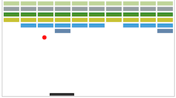

# Breakoïd
Breakoïd is a JavaScript bricks breaking game. Built for fun and training on free time.



## Use it
1. Take a canvas:
```html
<canvas id="canvasid" width="500" height="400">
    Your browser does not support the canvas element.
</canvas>
```

2. Include breakoid.js and do:
```javascript
var breakoid = new Breakoid('canvasid')
breakoid.start()
```

* Breakoïd calculates your bricks' width according to the canvas's width, the number of columns (NBCOLS) and the space between bricks (EMPTY_SPACE).
* Try to play with Breakoïd's constants to custom your game.
* Press 'p' to pause and resume the game.

## Disclaimer and suggestions
This is a very basic game but I'd wish to make it functionnal and playable. **Fell free to submit pull requests or roadmap suggestions**. Especially if your good at Maths and stuff like this.

## Roadmap
- Finish the basics (ex: sides/top of bricks collisions).
- Better bricks placement (random or organized by levels) for funnier game.
- Points counter, multiple lives… Classic stuff.
- Multiplayer.

## Licensing
```
Copyright (C) 2013 by Thibault Charbonnier.

Permission is hereby granted, free of charge, to any person obtaining a copy of this software and associated documentation files (the "Software"), to deal in the Software without restriction, including without limitation the rights to use, copy, modify, merge, publish, distribute, sublicense, and/or sell copies of the Software, and to permit persons to whom the Software is furnished to do so, subject to the following conditions:

The above copyright notice and this permission notice shall be included in all copies or substantial portions of the Software.

THE SOFTWARE IS PROVIDED "AS IS", WITHOUT WARRANTY OF ANY KIND, EXPRESS OR IMPLIED, INCLUDING BUT NOT LIMITED TO THE WARRANTIES OF MERCHANTABILITY, FITNESS FOR A PARTICULAR PURPOSE AND NONINFRINGEMENT. IN NO EVENT SHALL THE AUTHORS OR COPYRIGHT HOLDERS BE LIABLE FOR ANY CLAIM, DAMAGES OR OTHER LIABILITY, WHETHER IN AN ACTION OF CONTRACT, TORT OR OTHERWISE, ARISING FROM, OUT OF OR IN CONNECTION WITH THE SOFTWARE OR THE USE OR OTHER DEALINGS IN THE SOFTWARE.
```

  